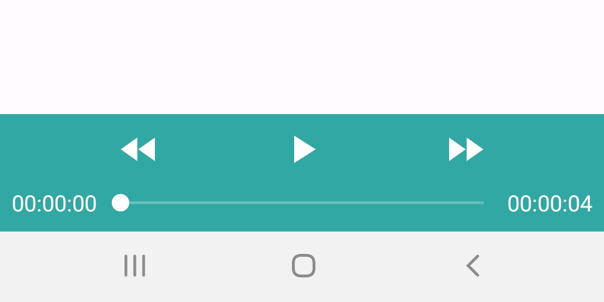
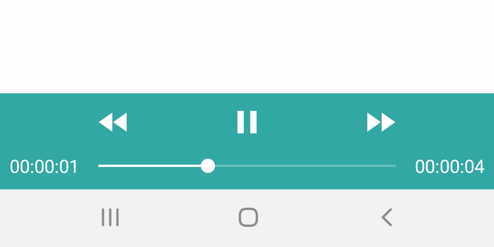
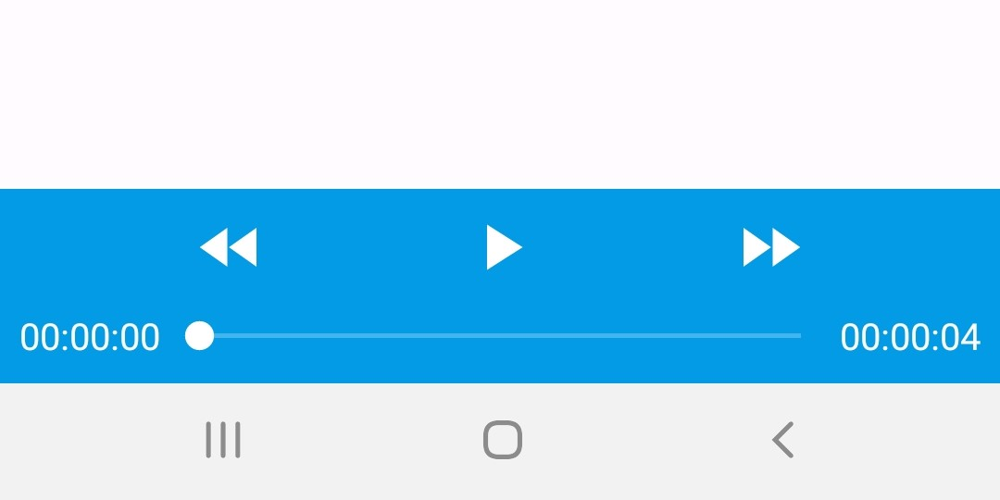

# SimpleAudioController

[](https://jitpack.io/#HyunJinNo/SimpleAudioController)

<br/>

## Index

[1. Examples](#examples)

[2. Gradle Setup](#gradle-setup)

[3. How to use](#how-to-use)

<br/>

## Examples

 
 

<br/>

## Gradle Setup

To get this library into your build:

#### Step 1. Add the JitPack repository to your build file.

Add it in your settings.gradle at the end of repositories:

```
repositories {
    ...
    maven { url 'https://jitpack.io' }
}
```

#### Step 2. Add the dependency.

Add it in your build.gradle (:app):

```
dependencies {
    ...
    implementation 'com.github.HyunJinNo:SimpleAudioController:0.0.1'
}
```

<br/>

## How to use

#### Step 1. Add the following permission to your AndroidManifest.xml.

```
<manifest xmlns:android="http://schemas.android.com/apk/res/android"
    xmlns:tools="http://schemas.android.com/tools">

    ...
    <uses-permission android:name="android.permission.READ_EXTERNAL_STORAGE" />
    ...

</manifest>
```

#### Step 2. Request the permission before playing audio file.

```
class MainActivity : AppCompatActivity() {
    private var permissions: Array<String> = arrayOf(
        Manifest.permission.READ_EXTERNAL_STORAGE
    )

    companion object {
        private const val REQUEST_PERMISSIONS = 200
    }

    override fun onCreate(savedInstanceState: Bundle?) {
        ...
        requestPermissions(permissions, REQUEST_PERMISSIONS)
    }

    override fun onRequestPermissionsResult(
        requestCode: Int,
        permissions: Array<out String>,
        grantResults: IntArray
    ) {
        super.onRequestPermissionsResult(requestCode, permissions, grantResults)
        val flag = if (requestCode == REQUEST_PERMISSIONS) {
            grantResults.all { it == PackageManager.PERMISSION_GRANTED }
        } else {
            false
        }

        if (!flag) {
            Toast.makeText(applicationContext, "Permissions rejected.", Toast.LENGTH_SHORT).show()
            finish()
        }
    }
}
```

#### Step 3. Add SimpleAudioController to your xml file.

```
    <view
        android:id="@+id/audioController"
        class="com.example.audiocontrollerlibrary.AudioController"
        android:layout_width="0dp"
        android:layout_height="wrap_content"
        app:layout_constraintBottom_toBottomOf="parent"
        app:layout_constraintEnd_toEndOf="parent"
        app:layout_constraintStart_toStartOf="parent" />
```

#### Step 4. After the permission granted, set audio file you want to play.

This setAudioSource(filepath) method works properly only after the permission granted.

```
class MainActivity : AppCompatActivity() {
    private lateinit var binding: ActivityMainBinding

    override fun onCreate(savedInstanceState: Bundle?) {
        super.onCreate(savedInstanceState)
        binding = ActivityMainBinding.inflate(layoutInflater)
        setContentView(binding.root)

        val filepath = File(Environment.getExternalStorageDirectory(), "[Your Audio File]").absolutePath
        binding.audioController.setAudioSource(filepath)
        ...
    }
}
```
